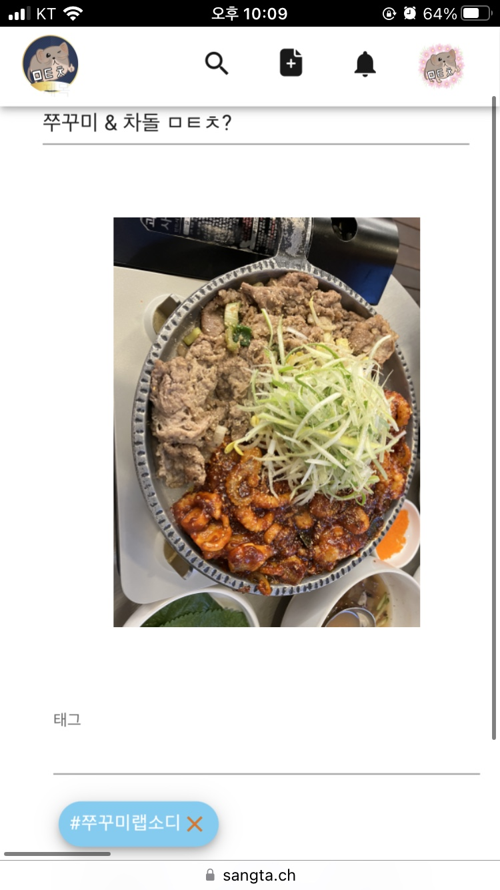

# MTC - 간단하게 즐길 수 있는 SNS
<p align="center"></p>

#  **MTC** 배경
<br>

 최근 커뮤니티에서 가장 유행했던 종류의 글 중 하나는 ‘**ㅁㅌㅊ(몇타치)’** 글입니다. 

 자기가 먹은 점심 혹은 저녁, 깎은 헤어 스타일, 합격한 합격증, 본인이 열심히 운동해서 만든 멋있는  몸 등등, 무엇이든 올린 후 글 제목으로 ‘ㅁㅌㅊ ‘인지 다른 사람들에게 물어보는 것입니다.

 그러면 사람들은 그 사진과 글 내용을 보고 맘에 들면 (ㅅㅌㅊ / 상타치), 평범하면 (ㅍㅌㅊ / 평타치), 별로면 (ㅎㅌㅊ / 하타치)로 평가도 해주고, 댓글로 재미있는 글을 남깁니다. 

 이러한 종류의 글이 각종 게시물에 등장하는 것을 보고, 정말 아무 사진이나 올리고 재미있는 제목을 지어 평가도 하고 댓글도 달 수 있는 SNS가 있다면 재미있을 것 같다는 생각이 들었습니다.


<br><br><br>


#  **MTC** 개요
<br>

 <u>***내가 올린 사진을 평가 받고, 다른 사람이 올린 사진을 평가하고 !***</u>

  <br>

 자신이 생각하기에 재미있었던, 혹은 알려주고 싶은 상황이나 경험 그 외 모든 것들을 사진(게시물)으로 게시하고 평가 받는, 그리고 평가하는 서비스 입니다.

 자신의 생각을 공유하고 평가 받거나, 남의 생각에 평가해주고 싶은 사람들이 편하게 접근할 수 있도록 상황이나 물건 등의 상태를 평가하는 밈(meme)인 ‘**몇타치**’를 섞어서 가벼운 컨셉으로 개발했습니다.

 사용자는 자신이 평가 받고 싶은 것을 ‘**이거 ㅁㅌㅊ?**’ 와 같은 제목으로 게시물을 올려, 댓글과 3가지 버튼(ㅅㅌㅊ, ㅍㅌㅊ, ㅎㅌㅊ)을 통해서 해당 게시물에 대한 반응을 확인해볼 수 있습니다.

<u>(ㅅㅌㅊ : 상타치, 평균 이상 / ㅍㅌㅊ : 평타치, 평균 / ㅎㅌㅊ : 하타치, 평균 이하)</u>

 <br>

  또한, 반대로 사용자는 랜덤으로 올라오는 다른 사람이 게시한 사진을 확인하고 평가할 수 있습니다. 이때 ‘ㅅㅌㅊ’ 수가 높은 게시물은 다른 사용자에게 보여질 랜덤 확률이 올라갑니다! 추가로, 검색 기능으로 자신이 원하는 글을 제목이나 해시 태그를 통해 찾아볼 수 있습니다. 

 그리고 공유 기능을 통해 재미있거나 참신한 게시물을 친구 혹은 지인들에게 알려줄 수 있어서 흥미를 느낀 다양한 사람들을 유입 시킬 수 있을 것입니다.


<br><br><br><br><br><br>


# **MTC** 주요 기능

<br>

## **아래 사진과 함께 주요 기능을 설명합니다**

<br>

- ## 게시물 작성
    - 간단하게 원하는 사진을 해시태그와 함께 등록이 가능합니다.
    <br>

<p align="center"></p>

<br>

- ## 게시물 평가 
    - 다른 사용자가 올린 게시물을 우측에 있는 상, 평, 하 버튼을 통해 평가할 수 있습니다.

<br>

<p align="center"></p>

<br>

- ## 댓글 작성
    - 다른 사용자가 올린 게시물을 아래에 있는 댓글창을 통해 댓글을 등록할 수 있습니다.
    <br>

<p align="center"></p>

<br>

- ## 알람 확인
    - 다른 사용자로부터 온 알림을 확인할 수 있습니다.
    <br>

<p align="center"></p>
<p align="center"></p>

<br>

- ## 게시물 검색
    - 해시태그 및 게시물 제목으로 원하는 게시물을 검색할 수 있습니다.
    <br>

<p align="center"></p>


<br><br><br><br><br><br>

# Conventions

<br>

## ⚙ 주요 기술
<br>

- **Frontend**
    - React
        - Visual Studio Code IDE
        - Java Script
        - Node.js : 16.18.1

- **Backend**
    - Spring
        - IntelliJ IDE
        - Project : Gradle - Groovy
        - Language : Java 11
        - Spring boot : 2.7.7
        - Packaging : Jar
        - Dependencies
        ➡ Spring Web
        ➡ Lombok
        ➡ MySQL Driver
        ➡ Spring Data JPA
        ➡ Spring Boot DevTools
        ➡ Spring Security
        ➡ Spring Boot DevTools
    - Flask
        - Python 3.9
        - NumPy
    
- **DataBase**
    - MySQL 8.0.31
    - Firebase
    - Amazone S3
    
- **CI/CD**
    - AWS EC2
    - Docker
    - Jenkins
    - Nginx
    - SSL


<br><br><br>


## ⚙깃 컨벤션
<br>

<u>참고(우아한형제들 기술블로그) : [https://techblog.woowahan.com/2553/](https://techblog.woowahan.com/2553/)</u>

<br>
<br>


### 커밋 메세지 규칙

<br>

- 커밋 메세지

    > **[커밋 타입]: 커밋 내용**
    
    <br>

    1. 타입과 본문을 **:** 으로 구분합니다.
    2. **타입**

        | 타입 | 설명 |
        | --- | --- |
        | Feat | 새로운 기능 추가 |
        | Add | 파일 추가 |
        | Modify | 파일 수정 |
        | Delete | 파일 삭제 |
        | Move | 파일 이동 |
        | Fix | 버그 수정 |
        | Test | 테스트 |
        | Correct | 문법 오류 및 오타 수정 |
        | Refactor | 리팩토링 |
        | Misc | 기타 |


<br><br>

- ### git-flow

<br>

    1. 브랜치명은 소문자
    2. feature 브랜치는 develop 브랜치에서 분기
    3. feature 브랜치 이름 → feature-[backend | frontend]-[기능명]
    4. 기능명이 합성어인 경우 ‘-’로 구분한다
    5. 원격 브랜치의 파일들이 필요하여 로컬의 브랜치로 pull할 경우 해당 파일들이 필요한 feature 브랜치에 pull하고 작업을 완료한 뒤 develop 브랜치에 merge하여 호환을 유지한다.

<br><br>


<br>

- ### branch 종류
    <br>
    
    - Master
    - Release
    - Develop
    - Feature

<br>


<br><br><br>

## 📔 Coding Convention

<br><br>

*아래 글을 참고하여 작성하였습니다.*

<br>

구글 코딩 컨벤션 : [https://google.github.io/styleguide/javaguide.html](https://google.github.io/styleguide/javaguide.html)

네이버 캠퍼스 핵데이 컨벤션 : [캠퍼스 핵데이 Java 코딩 컨벤션](https://naver.github.io/hackday-conventions-java/)

프론트엔드 스타일 가이드(에어비앤비) : [자바스크립트](https://github.com/ParkSB/javascript-style-guide), [리액트](https://github.com/apple77y/javascript/tree/master/react)

<br><br><br>

## 📌 Frontend

<br>

| 이름 | 설명 | 예시 |
| --- | --- | --- |
| 파일명 | Pascal | EduSsafy.jsx |
| 인스턴스 | Camel | eduSsafy |

<br>

1. 변수를 할당할 때 var 대신 const, let 사용한다.
2. 컴포넌트명은 파일명과 동일하게 작성한다.

<br><br><br>

## 📌 Backend

<br>

| *이름* | *설명* | *예시* |
| --- | --- | --- |
| 프로젝트명 | 모두 소문자 | mtc |
| 패키지 | 모두 소문자 | com.ssafy.common |
| 파일명 | Pascal | CamelCase |
| 클래스 | Pascal | CamelCase |
| 변수 | Camel | camelCase |
| 메소드 | 동사+목적어+전명구 | findNameById |

| *CRUD* | *Repo* | 
| --- | --- | 
| C | create |  
| R | read |  
| U | update |  
| D | delete |  

<br><br>

### 1. 경로는 필드별로 묶는다.

member - controller
service
board - controller  service
service

<br>

### 2. 변수는 개행하여 적는다.

int a , b; (x) int a;
int b;

<br>

### 3. for문과 if문은 반드시 블록으로 감싼다.

for(int a : number) { System.out.println(a) } (o)

for(int a : number) System.out.println(a) (x)

<br>

### 4. lombok사용

<br>

### 5. 패키지 명은 com.soez.mtc.* 로 설정한다.

<br>

### 6. 각 메소드 사이는 한 줄만 개행한다.

<br><br><br>


## 🎞 Database

<br>

### 1. 데이터베이스명, 테이블명, 테이블 속성은 소문자로 작성, 합성어는 _로 구분

<br>

### 2. 테이블 속성은 [테이블명]_[변수명] 으로 작성

<br>

### 3. DEFAULT CHARACTER SET

- utf8mb4, utf8mb4_0900_as_cs

<br>

### 4. 테이블 생성 시 이름은 백틱으로 감싸기, 문자는 홑따옴표로 작성.

<br>

### 5. ERD

<br>


<br><br><br><br><br><br>


# 💻 협업 툴

<br>

- ## Git
    - 프로젝트 버전 관리
    - Backend / Front 나눠서 각 기능별로 개발
- ## JIRA
    - 매주 목표량을 설정하여 Sprint 진행
    - Sprint 종료 시 목표량과 진행량에 대한 피드백
- ## Notion
    - 요구사항 및 에러 등 개발 상황 공유
    - 각 기능 별 개발에 필요한 정보 공유
    - 아침 스크럼 회의 기록
- ## MatterMost
    - 즉각적인 정보 공유 필요 시 소통

<br><br><br><br><br><br>


# 프로젝트 구조

<br>

## Backend

```
Spirng

mtc
├─alarm
│  ├─controller
│  ├─dto
│  ├─entity
│  ├─repository
│  └─service
├─article
│  ├─controller
│  ├─dto
│  ├─entity
│  ├─repository
│  └─service
├─comment
│  ├─controller
│  ├─dto
│  ├─entity
│  ├─repository
│  └─service
├─commentlike
│  ├─dto
│  ├─entity
│  └─repository
├─config
├─evaluate
│  ├─dto
│  ├─entity
│  ├─repository
│  └─service
├─exception
├─filter
├─hashtag
│  ├─dto
│  ├─entity
│  ├─repository
│  └─service
├─hashtagging
│  ├─entity
│  └─repository
├─recent
│  ├─entity
│  ├─repository
│  └─service
├─relation
│  ├─controller
│  ├─dto
│  ├─entity
│  ├─repository
│  └─service
├─reply
│  ├─controller
│  ├─dto
│  ├─entity
│  ├─repository
│  └─service
├─replylike
│  ├─dto
│  ├─entity
│  └─repository
├─report
│  ├─Controller
│  ├─dto
│  ├─entity
│  ├─repository
│  └─service
├─s3
├─setting
│  ├─controller
│  ├─dto
│  ├─entity
│  ├─repository
│  └─service
├─user
│  ├─controller
│  ├─dto
│  ├─entity
│  ├─repository
│  └─service
└─util


```

<br>

## Front

```
mtc
├─public
└─src
    ├─api
    ├─assets
    │  ├─fonts
    │  │  └─Dongle
    │  ├─icons
    │  └─images
    ├─components
    │  ├─CreatePost
    │  ├─Edit
    │  ├─NavigationBar
    │  ├─Notification
    │  ├─Post
    │  ├─Search
    │  ├─Settings
    │  ├─TeaserComponents
    │  ├─Test
    │  ├─UnderNavigationBar
    │  └─UserInformation
    ├─pages
    │  └─style
    └─redux
        ├─slice
        └─store
```


<br><br><br><br><br><br>

# 👥 팀원 소개

<br>

|      김원규      |         김희준         |       박한샘       |       이윤석       |       장인혁       |       조재경       |
| :------------------------------------------------------------------------------: | :---------------------------------------------------------------------------------------------------------------------------------------------------: | :---------------------------------------------------------------------------------------------------------------------------------------------------------------------------------------------------: | :---------------------------------------------------------------------------------------------------------------------------------------------------------------------------------------------------: | :---------------------------------------------------------------------------------------------------------------------------------------------------------------------------------------------------: | :---------------------------------------------------------------------------------------------------------------------------------------------------------------------------------------------------: |
|  |     |  |  |  |  |
|   [@wongyukim1997](https://github.com/wongyukim1997)   |  [@TraceofLight](https://github.com/TraceofLight)  | [@monsileI](https://github.com/monsileI) | [@dudnbubn](https://github.com/dudnbubn) | [@v7153623](https://github.com/v7153623) | [@joripje](https://github.com/joripje) |
| [BE] CI/CD, User Auth Logic, Git Master | [FE] UI/UX, Firebase, User | [BE] Follow & Block, Alarm, DB | [BE] Post, ML Recommend System, DB | [BE] Comments & Reply, Report, PM |              [FE] UI/UX, Wireframe, Main, Post               |

<br>


# 📑 그 외 프로젝트 기능

<br>

- 마이 페이지 (자신)
    - 자신의 마이 페이지를 들어가면 

<p align="center"></p>

<br>

- 마이 페이지 (다른 유저)
    - 다른 유저의 마이 페이지를 들어가면 작성글, 팔로우 정보를 확인할 수 있습니다.

<p align="center"></p>

<br>

- 게시물 공유, 신고, 차단 기능
    - 게시물 메뉴 버튼을 클릭하면 해당 게시물에 대한 공유, 신고, 차단 기능을 사용할 수 있습니다.
<p align="center"></p>

<br>

- 유저 개인 설정 페이지

<p align="center"></p>

<br>

- 팔로우 리스트 확인
    - 자신이 팔로우한 유저의 리스트를 확인할 수 있습니다.

<p align="center"></p>

<br>

- 차단 리스트 확인
    - 자신이 차단한 유저의 리스트를 확인할 수 있습니다.

<p align="center"></p>


